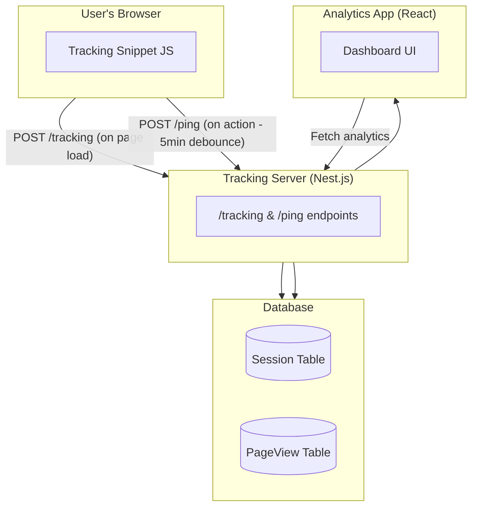
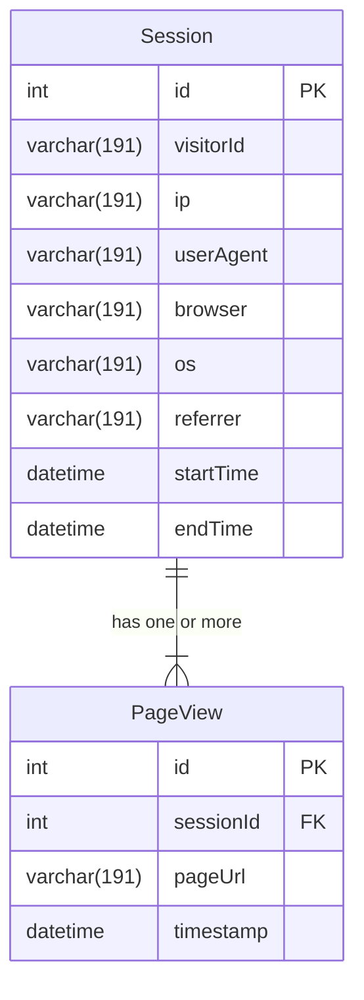

# Yomali Tracking Assessment - Backend

This project is a **backend service** built with [NestJS](https://nestjs.com/) and [Prisma](https://www.prisma.io/).  
It is responsible for collecting and serving **analytics data** from user sessions and page views.  

The backend exposes endpoints used by a client-side tracking snippet (`/tracking` and `/ping`) and provides aggregated data for a React-based analytics dashboard.

---

## Features

- **NestJS Framework** – Modular and scalable backend.
- **Prisma ORM** – Type-safe database access and migrations.
- **Swagger Integration** – Interactive API documentation.
- **Dockerized** – Easy deployment and environment consistency.
- **Testing** – Includes unit tests and end-to-end (e2e) tests.

---

## Architecture Overview

- A **browser snippet** sends data to the backend:
  - `POST /tracking` → triggered on page load.
  - `POST /ping` → triggered on user actions (with a 5-minute delay between pings).
- The backend stores session and page view data in a relational database via **Prisma**.
- Data can be queried by a **React analytics dashboard** for reporting and visualization.


## Database Schema




---

## Getting Started

### Prerequisites
- [Node.js](https://nodejs.org/) (>= 18.x recommended)
- [Docker](https://www.docker.com/) (for containerized setup)
- [Prisma CLI](https://www.prisma.io/docs/getting-started)

### Installation
Clone the repository and install dependencies:

```bash
git clone https://github.com/lucaslosekann/yomali-challenge-backend.git
cd yomali-challenge-backend
npm install
```

### Database Setup
1. Run Prisma migrations to set up the database schema:
```bash
npx prisma migrate dev
   ```
2. (Optional) Open Prisma Studio to inspect data:
```bash
npx prisma studio
```

### Running the Application
Start the development server:
```bash
npm run start:dev
```
The server will be running at `http://localhost:3000`.
(or the port specified in the $PORT environment variable).

### Docker
Build and run with Docker:
```bash
docker build -t yomali-backend .
docker run -p 3000:3000 yomali-backend
```

### API Documentation
Access the Swagger API documentation at: `http://localhost:3000/api`.

### Testing
Run unit and e2e tests:
```bash
npm run test
npm run test:e2e
```

### Environment Variables
The application uses the following environment variables (set in a `.env` file or your deployment environment):
- `DATABASE_URL` – Database connection string.
- `PORT` – Port for the server to listen on (default: 3000).

---

### Tech Stack
- **Backend Framework**: [NestJS](https://nestjs.com/)
- **ORM**: [Prisma](https://www.prisma.io/)
- **Database**: [MySQL](https://www.mysql.com/)
- **API Documentation**: [Swagger](https://swagger.io/)
- **Testing**: [Jest](https://jestjs.io/)
- **Containerization**: [Docker](https://www.docker.com/)

---


### Notes
- This project is part of a technical assessment for Yomali.
- The backend is open (no authentication) for simplicity in the assessment context.
- The main focus is clean architecture, testability, and data collection for analytics.